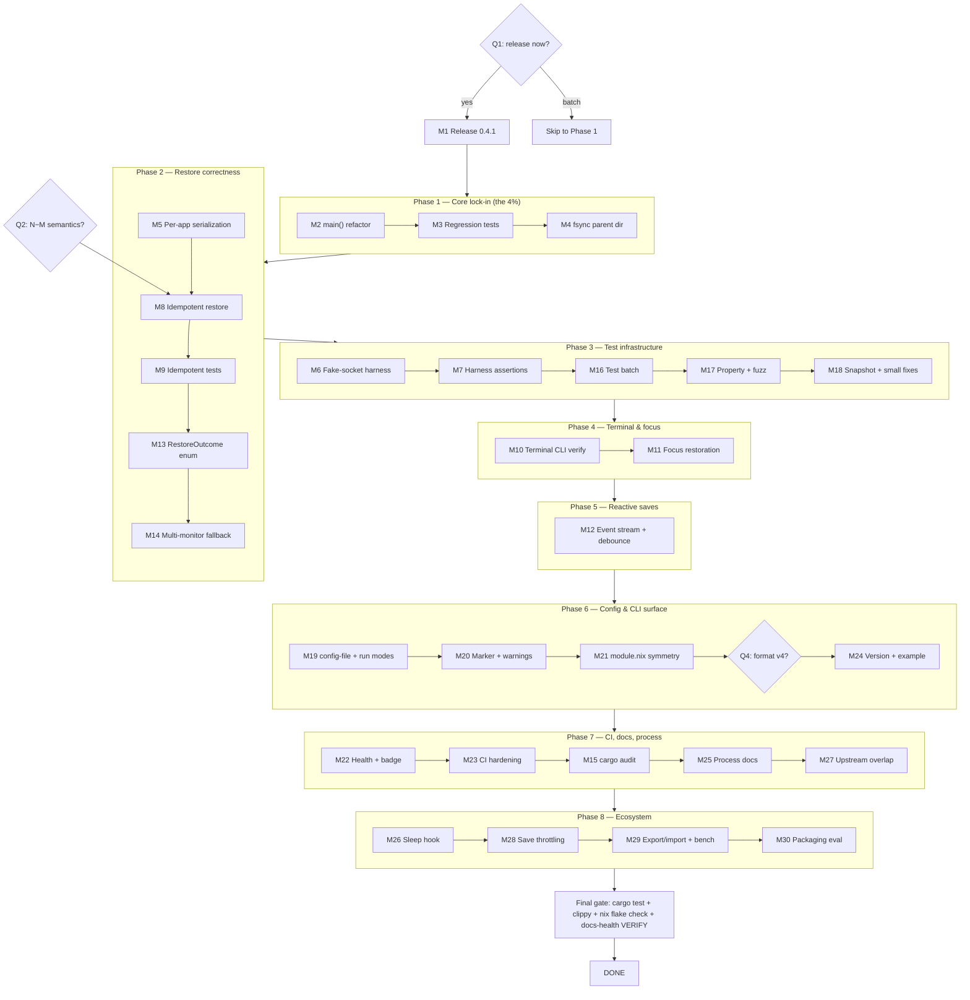

# Pareto Execution Plan — niri-session-manager

**Date:** 2026-09-03 15:47 CEST
**Scope:** ALL known TODOs — 31 TODO_LIST items + 19 status-report items (32–50) + 4 ROADMAP open questions = 54 items, each mapped into exactly one medium task (30–100 min) and one or more micro tasks (≤12 min).
**Source of truth:** `TODO_LIST.md` (living), `ROADMAP.md`, `docs/status/2026-09-03_12-27_docs-health-audit-living-docs.md` (f).
**Definition of "result":** a session manager SystemNix can trust — restores correctly, never duplicates, never loses data, ships its fixes, and stays testable.

> ⚠️ anti-Verschlimmbesser rules honored: this plan **only adds** `docs/planning/` content. No living doc is rewritten. New items (32–50) stay plan-only until you approve routing them into TODO_LIST/ROADMAP.

---

## Step 1 — Pareto Breakdown

| Tier | Share of work | Delivers | Tasks | Why this tier |
|------|---------------|----------|-------|---------------|
| **1%** | ~30 min of ~40 h | **51%** | **M1 Release 0.4.1** (T5) | Two sessions of bug fixes are invisible to the only consumer (SystemNix pins the flake). Shipping converts ALL accumulated fixed value into delivered value. Nothing else multiplies like this |
| **4%** | ~2.5 h | **+13% → 64%** | **M2+M3 main() refactor → regression tests** (T3), **M4 fsync parent dir** (T8) | Locks the 0.4.0 correctness core (dry-run contract, shutdown final save) against silent regression, and closes the last durability hole in `atomic_write`. Insurance on everything already built |
| **20%** | ~9 h | **+16% → 80%** | **M5 per-app serialization** (T2), **M8/M9 idempotent restore** (T1, gate Q2), **M6/M7 fake-socket harness** (T4, T12), **M10 terminal CLI verification** (T9), **M13 outcome type** (T7) | Kills the three remaining user-visible correctness gaps (duplicates on retry, swapped workspaces, broken terminal restore) and builds the test foundation that makes the rest safe |
| **80%** | the rest | **→ 100%** | M11–M30 + micro tail | Focus restoration, event stream, multi-monitor, CLI surface, CI/docs hardening, ecosystem — real but incremental |

**Decision gates inside the plan:** Q1 (release now?) gates M1; Q2 (idempotent semantics) gates M8/M9; Q4 (format version) gates M24. Unanswered gates do not block other phases.

---

## Step 2 — Comprehensive Plan (30–100 min tasks, ALL todos, priority-sorted)

| Rank | ID | Task (30–100 min) | Covers | Impact | Effort | Customer value |
|------|----|--------------------|--------|--------|--------|----------------|
| 1 | M1 | Release 0.4.1: bump, CHANGELOG, verify, tag, push, SystemNix pin note | T5, gate Q1 | High | 30 m | Fixes reach users |
| 2 | M2 | Extract boot-gate + shutdown from `main()` into pure/injectable units | T3a | High | 90 m | Testability of core |
| 3 | M3 | Regression tests: dry-run no-marker, dry-run no-save, shutdown final save | T3b | High | 60 m | Fixes can't regress |
| 4 | M4 | fsync parent dir in `atomic_write` + test | T8 | Med | 30 m | Crash durability |
| 5 | M5 | Per-app spawn serialization (keyed semaphores) + test | T2 | High | 45 m | No swapped workspaces |
| 6 | M6 | Fake niri-socket harness scaffold (listener, Windows/Workspaces, Spawn recorder) | T4a | High | 60 m | Unlocks IPC tests |
| 7 | M7 | Harness assertions: spawn order, semaphore cap, retry-loop injection | T4b, T12 | High | 60 m | Restore path tested |
| 8 | M8 | Idempotent restore: count running per app, spawn N−M (gate Q2) | T1a | High | 45 m | No duplicate windows |
| 9 | M9 | Idempotent restore tests + boot-gate interplay | T1b | High | 30 m | Trust in re-restore |
| 10 | M10 | Verify wezterm/ghostty/foot/kitty/alacritty flags vs real docs; fix profiles | T9 | Med | 45 m | Terminal restore works |
| 11 | M13 | `RestoreOutcome` enum, delete scattered `config.dry_run` branches | T7 | Med | 30 m | Simpler, safer restore |
| 12 | M11 | Focus restoration via saved `is_focused` | T10 | Med | 45 m | Desktop comes back as left |
| 13 | M17 | Property tests (proptest) round-trips + legacy aliases + parser fuzz | T17, #42 | Med | 45 m | Format can't corrupt |
| 14 | M14 | Multi-monitor: position-based output fallback when name misses | T13 | Med | 30 m | Docking survives |
| 15 | M12 | niri event-stream subscription + debounce + polling fallback | T6 | High | 90 m | Saves on change, not 15-min poll |
| 16 | M16 | Test batch: cleanup_old_backups, dedupe edges, SHELL-unset | T15, T16, T30 | Low | 30 m | Coverage debt down |
| 17 | M18 | Dry-run snapshot test + idx0 decision + max_walk_depth validation | T18, T27, T28 | Low | 30 m | Small correctness holes closed |
| 18 | M21 | module.nix `maxRestoreWindows` + README asymmetry note | T11, #36 | Med | 30 m | Feature usable from NixOS |
| 19 | M19 | `--config-file` + explicit `--restore`/`--save-only` run modes | T19, T31 | Low | 30 m | Scriptable control |
| 20 | M20 | Marker staleness cleanup + zero-terminals-matched warning | T20, T21 | Low | 30 m | Ops surprises removed |
| 21 | M22 | Health-check subcommand + `--version` CI smoke + CI badge | T23, T22, T24 | Med | 45 m | Operable + visible |
| 22 | M23 | CI: docs-freshness job + link/citation linter + cargo-deny | #33, #34, T26 | Med | 45 m | Docs can't rot silently |
| 23 | M15 | cargo audit + dependency refresh report | T14 | Med | 30 m | Supply-chain hygiene |
| 24 | M24 | SESSION_FORMAT_VERSION decision + impl + example session.json | #32/Q4, T29 | Med | 30 m | Format honesty |
| 25 | M25 | CONTRIBUTING.md + annotate-evidence policy + 🟡 release checklist + 0.2.0 cleanup + commit-message policy | T25, #35, #37, #38, #39 | Low | 45 m | Process durability |
| 26 | M26 | systemd sleep.target hook: save on suspend | #41 | Med | 60 m | State saved before sleep |
| 27 | M28 | Layout-hash save throttling (skip unchanged) | #45 | Med | 45 m | Less write/journal noise |
| 28 | M27 | niri upstream overlap evaluation → non-goals + archived-dir annotate check | #46, #40 | Med | 45 m | No duplicate upstream work |
| 29 | M29 | Session export/import CLI + restore burst benchmark | #44, #43 | Low | 60 m | Power-user safety |
| 30 | M30 | Packaging/ecosystem evaluation: crates.io, DMS spike, DOMAIN_LANGUAGE defer | #48, #49, #50 | Low | 45 m | Informed go/no-go |

**Coverage check:** 31/31 TODO_LIST + 19/19 status-report items + 4/4 open questions mapped. No todo appears in zero tasks.

---

## Step 3 — Micro Breakdown (≤12 min each, ALL todos, execution order)

| # | Task | Min | Covers |
|---|------|-----|--------|
| 0.1 | Ask Q1 gate: release 0.4.1 now? | 5 | T5 |
| 0.2 | Bump Cargo.toml 0.4.0 → 0.4.1 | 2 | T5 |
| 0.3 | Move CHANGELOG Unreleased → [0.4.1] | 5 | T5 |
| 0.4 | cargo test + clippy --all-features + fmt --check | 6 | T5 |
| 0.5 | nix build + nix flake check | 8 | T5 |
| 0.6 | Tag v0.4.1, push, SystemNix pin note | 6 | T5 |
| 1.1 | Read main() gate/shutdown block, mark extraction seams | 10 | T3 |
| 1.2 | Extract pure `should_restore(boot_id, marker, dry_run) -> Decision` | 12 | T3 |
| 1.3 | Route main() through it; delete inline logic | 8 | T3 |
| 1.4 | Extract `run_shutdown(save_task, paths, config)` | 12 | T3 |
| 1.5 | Suite green after extraction | 3 | T3 |
| 1.6 | Test: dry-run writes no restore-marker | 12 | T3 |
| 1.7 | Test: dry-run + missing session → no session.json | 10 | T3 |
| 1.8 | Test: shutdown awaits save task then final save runs | 12 | T3 |
| 1.9 | clippy + fmt + full suite | 5 | T3 |
| 1.10 | atomic_write: open parent dir + sync_all | 8 | T8 |
| 1.11 | Test parent fsync succeeds on tempdir | 8 | T8 |
| 1.12 | Suite green | 3 | T8 |
| 2.1 | Design keyed per-app semaphores (sketch in code) | 12 | T2 |
| 2.2 | Implement per-app acquisition in spawn task | 12 | T2 |
| 2.3 | Test: two same-app restores never interleave | 12 | T2 |
| 2.4 | clippy + suite | 5 | T2 |
| 2.5 | Count running windows per app pre-restore | 10 | T1 |
| 2.6 | Truncate spawn list to N−M per app | 12 | T1 |
| 2.7 | Skip app when M≥N + info log | 6 | T1 |
| 2.8 | Tests: partial / fully-running / single-instance interplay | 12 | T1 |
| 2.9 | Harness test: re-restore spawns only missing | 10 | T1 |
| 2.10 | Verify boot-marker semantics unchanged | 8 | T1 |
| 2.11 | Define `RestoreOutcome` | 5 | T7 |
| 2.12 | Return outcome; delete `config.dry_run` branches | 12 | T7 |
| 2.13 | Update affected tests | 8 | T7 |
| 2.14 | Output-position fallback when output name misses | 12 | T13 |
| 2.15 | Test: renamed output still places window | 10 | T13 |
| 3.1 | Study niri-ipc reply frames for minimal server | 12 | T4 |
| 3.2 | Tempdir Unix listener serving Windows/Workspaces | 12 | T4 |
| 3.3 | Action::Spawn recorder channel | 10 | T4 |
| 3.4 | Test: restore spawns recorded commands in order | 12 | T4 |
| 3.5 | Test: ≤5 concurrent spawns (semaphore) | 8 | T4 |
| 3.6 | Retry-loop failure-injection test | 12 | T12 |
| 3.7 | cleanup_old_backups test | 10 | T15 |
| 3.8 | dedupe PID-crossing-app edge test | 12 | T16 |
| 3.9 | SHELL-unset / passwd-failure test | 8 | T30 |
| 3.10 | Add proptest dev-dependency | 3 | T17 |
| 3.11 | Property: SavedWindow round-trip == identity | 12 | T17 |
| 3.12 | Property: legacy keys via serde alias | 10 | T17 |
| 3.13 | Fuzz parse: truncated/corrupt JSON never panics | 12 | #42 |
| 3.14 | Dry-run output snapshot test | 12 | T18 |
| 3.15 | idx=0 legacy: skip (niri 1-based) + test | 10 | T27 |
| 3.16 | Validate max_walk_depth ≥ 1 | 6 | T28 |
| 4.1 | Verify wezterm profile vs CLI docs | 10 | T9 |
| 4.2 | Verify ghostty + foot profiles | 12 | T9 |
| 4.3 | Verify kitty + alacritty profiles | 10 | T9 |
| 4.4 | Fix any wrong flag + profile test | 12 | T9 |
| 4.5 | Emit focus action for is_focused window | 12 | T10 |
| 4.6 | Test: focus command in spawn record | 10 | T10 |
| 5.1 | niri event-stream protocol spike | 12 | T6 |
| 5.2 | Debounce design (quiet window) | 10 | T6 |
| 5.3 | Subscribe + save-on-change loop | 12 | T6 |
| 5.4 | Polling fallback when subscription dies | 10 | T6 |
| 5.5 | Harness test: layout event triggers save | 12 | T6 |
| 6.1 | `--config-file` flag + plumbing | 8 | T19 |
| 6.2 | `--restore` / `--save-only` run modes | 12 | T31 |
| 6.3 | Tests for both | 10 | T19, T31 |
| 6.4 | Prune stale restore-marker on boot | 10 | T20 |
| 6.5 | Warn when terminal_state on but 0 matched | 8 | T21 |
| 6.6 | Tests for 6.4/6.5 | 8 | T20, T21 |
| 6.7 | module.nix maxRestoreWindows option | 12 | T11 |
| 6.8 | README options asymmetry note | 6 | #36 |
| 6.9 | nix flake check | 4 | T11 |
| 6.10 | Implement format-version decision (Q4) | 12 | #32 |
| 6.11 | Write docs/example-session.json | 10 | T29 |
| 7.1 | `--health-check` subcommand (socket ping + marker status) | 12 | T23 |
| 7.2 | `--version` smoke step in CI | 6 | T22 |
| 7.3 | CI badge in README | 4 | T24 |
| 7.4 | Workflow edit + dry-run of CI steps | 8 | T22–T24 |
| 7.5 | Docs-freshness CI job (counts vs docs) | 12 | #33 |
| 7.6 | Link + file:line citation linter | 12 | #34 |
| 7.7 | cargo-deny config + CI step | 10 | T26 |
| 7.8 | CONTRIBUTING.md | 12 | T25 |
| 7.9 | Annotate-evidence policy → AGENTS.md | 8 | #35 |
| 7.10 | 🟡-status release checklist → AGENTS.md | 6 | #39 |
| 7.11 | Shorten/verify 0.2.0 CHANGELOG section | 8 | #37 |
| 7.12 | Commit-message policy note → AGENTS.md | 4 | #38 |
| 7.13 | cargo audit run + refresh report | 12 | T14 |
| 7.14 | Apply safe dependency bumps + suite | 10 | T14 |
| 7.15 | niri upstream overlap evaluation → ROADMAP | 12 | #46 |
| 7.16 | Verify annotate scripts handle archived/ paths | 6 | #40 |
| 8.1 | module.nix sleep.target binding | 12 | #41 |
| 8.2 | Save-on-suspend signal path | 12 | #41 |
| 8.3 | Sleep-hook docs + module test | 8 | #41 |
| 8.4 | Layout-hash: skip unchanged saves | 12 | #45 |
| 8.5 | Verify journal noise drop | 8 | #45 |
| 8.6 | `export` subcommand (copy session + backups) | 12 | #44 |
| 8.7 | `import` subcommand + validation | 12 | #44 |
| 8.8 | Restore burst benchmark script + numbers | 12 | #43 |
| 8.9 | crates.io publishability evaluation | 10 | #48 |
| 8.10 | DMS session-display spike notes | 10 | #49 |
| 8.11 | DOMAIN_LANGUAGE.md defer note in ROADMAP | 2 | #50 |

**Micro coverage:** 100 micro tasks ≈ 13.5 h; every one of the 54 todos appears at micro granularity. Sorted by execution order = priority order (release → core lock-in → restore correctness → test infra → terminal/focus → reactive → surface → CI/docs → ecosystem).

---

## Execution Graph

**Parallelizable:** M6/M7 (harness) is independent of M2–M5 and can run alongside; M23 CI work is independent of all code phases; M15 audit runs anytime.

---

## Harvest note

Items 32–50 are **plan-only** until you approve routing them into `TODO_LIST.md` / `ROADMAP.md` (docs-health HARVEST). Items 1–31 already live in TODO_LIST.md; after executing any M-task, its TODO_LIST row moves to CHANGELOG (never stays in TODO_LIST).

## Verification per phase

Every phase ends with: `cargo test` (suite green) + `cargo clippy --all-features` (0 issues) + `cargo fmt --all -- --check` + `nix flake check`. Release phase additionally: `nix build` + tag push. No phase starts if the previous one's gate is red — **do not break the build**.
