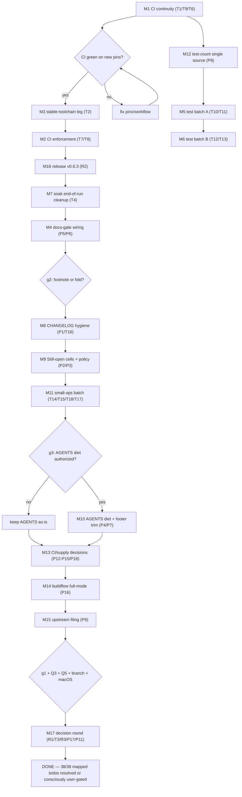

# Pareto Execution Plan II — CI Continuity, Verification Lock-In, and the Bounded Tail

**Date:** 2026-09-27 01:11 CEST
**Scope:** ALL known open TODOs — 17 `TODO_LIST.md` rows + 18 new items surfaced by the 2026-09-27 docs-health pass (status report §f/§g, not yet routed) + 3 user-gated ROADMAP items = **38 todos**, each mapped into exactly one medium task (30–100 min) and one or more micro tasks (≤12 min).
**Source of truth:** `TODO_LIST.md` (living), `ROADMAP.md` (Q3/Q5), `docs/status/2026-09-27_01-05_docs-health-annotate-archive-pass.md` (§f/§g).
**Definition of "result":** the verification apparatus cannot silently die (CI continuity + enforcement), the repo's two hard constraints (stable Rust, linted tests) are CI-enforced, and every remaining gap is either a bounded test, a one-line doc fix, or a precisely-asked user decision.

> ⚠️ anti-Verschlimmbesser rules honored: this plan **only adds** `docs/planning/` content — no living doc is rewritten. New items (the 18 plan-only ones) stay plan-only until you approve routing them into `TODO_LIST.md`; the plan never edits a status report or a released CHANGELOG section. User-gated items (suspend cycle, Q3/Q5, branch protection) block nothing else.

---

## Step 1 — Pareto Breakdown

Total plan effort ≈ 12 h across 17 medium tasks.

| Tier    | Effort   | Delivers | Tasks                                                                                                                                                                | Why this tier                                                                                                                                                                                                                                                                                        |
| ------- | -------- | -------- | -----------------------------------------------------------------------------------------------------------------------------------------------------------------    | ------------------------------------------------------------------------------------------------------------------------------------------------------------------------------------------------                                                                                                     |
| **1%**  | ~1 h     | **51%**  | **M1 CI continuity** (T1 Node20 pins, T9 concurrency group, T6 actionlint step)                                                                                      | The entire verification apparatus (tests, clippy, docs-citations, markdownlint, test-count, release CI, drift-guard) dies the day GitHub drops the Node20 shim — with zero repo changes. One hour removes the only known kill-switch.                                                                |
| **4%**  | ~2.75 h  | **64%**  | **M1 + M3 stable-toolchain CI leg (T2) + M2 CI enforcement (T7 `--all-targets`, T8 `--locked`)**                                                                     | Locks the repo's two hard constraints into CI: "must compile on stable Rust" (a past release broke NixOS stable over a `let` chain) and "tests are linted" (the CI-green/local-red split brain already cost a session). Converts local-only gates into enforced ones.                                |
| **20%** | ~6.2 h   | **80%**  | **+ M16 release v0.6.3 (R2), M12 test-count single source (P8), M5/M6 test batches (T10/T11/T12/T13), M7 soak end-of-run cleanup (T4), M4 docs-gate wiring (P5/P6)** | Ships the accumulated `[Unreleased]` + CI hardening (standing policy: ship fixes, don't batch), makes the CI test-count self-maintaining, closes the four bounded test gaps, fixes the soak script's known flake source, and wires the new docs toolchain so the next docs pass can't regress MD060. |
| **80%** | the rest | **100%** | M8–M15, M17 + user-gated decisions                                                                                                                                   | CHANGELOG honesty ([0.6.1] footnote, compare-links), docs-system closure (Still-open cells, policy line), AGENTS diet, small-ops batch, supply-chain decisions, buildflow baseline, upstream filing, and the user-decision round. Real but incremental.                                              |

**Decision gates inside the plan:** g1 (suspend/resume authorization) gates M17/R1; g2 ([0.6.1] footnote vs fold) gates M8; g3 (AGENTS diet authorization) gates M10; Q3/Q5/branch-protection/macOS gate M17 only. Unanswered gates do not block other phases.

---

## Step 2 — Comprehensive Plan (30–100 min tasks, ALL todos, priority-sorted)

| Rank | ID  | Task (30–100 min)                                                                                                                                             | Covers                  | Impact        | Effort | Customer value                                      |
| ---- | --- | --------------------------------------------------------------------------------------------------------------------                                          | -------------           | --------      | ------ | ------------------------------------------------    |
| 1    | M1  | CI continuity: bump Node20-pinned actions, add `concurrency:` group, add actionlint step; push + verify green run                                             | T1, T9, T6              | High          | 60 m   | CI cannot silently die; superseded runs cancel      |
| 2    | M3  | Stable-toolchain CI leg (`cargo +stable build/test`) — enforces the NixOS-stable guarantee                                                                    | T2                      | High          | 60 m   | Past release class (nightly-only) can't recur       |
| 3    | M2  | CI enforcement: clippy → `--all-features --all-targets`; `--locked` on build/test/clippy                                                                      | T7, T8                  | High          | 45 m   | Tests linted in CI; Cargo.lock drift caught         |
| 4    | M16 | Release v0.6.3: fold `[Unreleased]` (canary fix + M1–M3 hardening), bump, gates, tag + push, verify tag CI                                                    | R2                      | High          | 45 m   | Standing policy: ship fixes; SystemNix can pin      |
| 5    | M12 | `scripts/test-count.sh` as the single source for CI `expected=`; CI consumes its output                                                                       | P8                      | Medium        | 30 m   | Test-count can't drift between CI and docs          |
| 6    | M5  | Test batch A: clap conflict tests (mode flags) + reconnect-backoff reset (alive ≥5s) regression test                                                          | T10, T11                | Medium        | 45 m   | CLI contract + backoff reset pinned                 |
| 7    | M6  | Test batch B: full `DEFAULT_APP_CONFIG_TOML` ↔ `AppConfig` sync test + `--health-check` layout-line test                                                      | T12, T13                | Medium        | 45 m   | Template drift + reported fields pinned             |
| 8    | M7  | Soak script: end-of-run carrier cleanup (trap/EXIT), verified without a desktop-disrupting run                                                                | T4                      | Medium        | 45 m   | No more hand-closed leftover carriers               |
| 9    | M4  | Docs-gate wiring: realigner into AGENTS commands + `--check` mode; CONTRIBUTING docs-toolchain paragraph                                                      | P5, P6                  | Medium        | 40 m   | MD060 breaks die at the gate; next pass onboards    |
| 10   | M8  | CHANGELOG hygiene: `[0.6.1]` footnote (pending g2) + Keep-a-Changelog compare-links footer                                                                    | P1, T16                 | Low           | 30 m   | Tag/section mismatch resolved; changelog navigable  |
| 11   | M9  | Docs-system closure: `Still open` cells in 15-04/18-16 tables (check-rows green) + brainstorm-policy line in AGENTS                                           | P2, P3                  | Low           | 30 m   | Old reports self-describing; policy decided once    |
| 12   | M11 | Small-ops batch: config-version startup hint, fixture-refresh procedure (AGENTS), module.nix comment, vulnix reminder                                         | T14, T15, T18, T17      | Low           | 40 m   | Config drift caught; AGENTS operational gaps closed |
| 13   | M10 | AGENTS.md diet (25 KB → ≤15 KB: compress fork saga, drop `~` counts, dedupe) + TODO_LIST footer trim (pending g3)                                             | P4, P7                  | Low           | 45 m   | Context budget per session shrinks                  |
| 14   | M13 | CI/supply-chain decisions batch: dependabot content verify, deny fail-closed assert, magic-cache decision, `--all-features` resolution, nightly scheduled run | P18, P13, P12, P14, P15 | Low           | 60 m   | Supply-chain and CI breadth decided, not drifting   |
| 15   | M14 | BuildFlow full-mode baseline run (`nix develop -c buildflow --build-mode full`) + verdict recorded                                                            | P16                     | Low           | 30 m   | Complete-gate evidence current                      |
| 16   | M15 | File `check-rows.py` separator-row false positive upstream (crush-config) with this pass's evidence                                                           | P9                      | Low           | 30 m   | Tooling fixed for every future docs pass            |
| 17   | M17 | User-decision round: prepare brief, record answers — suspend cycle (g1), Q3, Q5, branch protection, macOS CI                                                  | R1, T3, R3, P17, P11    | Medium (user) | 30 m   | Last acceptance leg + product decisions unblocked   |

**Coverage check:** 17/17 TODO_LIST rows + 18/18 plan-only items + 3/3 ROADMAP/user items = 38/38 mapped. No todo appears in zero tasks. (T5 "promote the realigner" was removed from TODO_LIST last pass — done.)

---

## Step 3 — Micro Breakdown (≤12 min each, ALL todos, execution order)

| #    | Task                                                                                | Min | Covers               |
| ---- | ----------------------------------------------------------------------------------  | --- | --------             |
| 1.1  | Read `checks.yml` action blocks; look up current checkout/nix-installer pinned SHAs | 10  | T1                   |
| 1.2  | Bump both pins past Node20 deprecation                                              | 10  | T1                   |
| 1.3  | Add `concurrency: { group: checks, cancel-in-progress: true }`                      | 8   | T9                   |
| 1.4  | Add actionlint step (`nix run nixpkgs#actionlint`)                                  | 10  | T6                   |
| 1.5  | Run actionlint + review diff locally                                                | 8   | T6                   |
| 1.6  | Commit (detailed message) + push + fire `workflow_dispatch`                         | 8   | T1                   |
| 1.7  | Watch run green; capture run ID into TODO row; remove TODO row                      | 10  | T1                   |
| 3.1  | Design stable leg: step in existing job vs separate job (startup cost)              | 10  | T2                   |
| 3.2  | Implement `cargo +stable build` + `cargo +stable test` step                         | 12  | T2                   |
| 3.3  | Local parity if a stable toolchain is installed; else rely on the runner            | 10  | T2                   |
| 3.4  | Push; verify green on the fixed head; TODO row removed                              | 8   | T2                   |
| 2.1  | Switch CI clippy step to `--all-features --all-targets`                             | 5   | T7                   |
| 2.2  | Add `--locked` to CI build/test/clippy steps                                        | 10  | T8                   |
| 2.3  | Local parity: run the exact CI forms (must be clean)                                | 10  | T7, T8               |
| 2.4  | Push; verify green; remove both TODO rows                                           | 8   | T7, T8               |
| 16.1 | Fold `[Unreleased]` → `[0.6.3]`; bump Cargo.toml + Cargo.lock                       | 10  | R2                   |
| 16.2 | Grep version references (README, AGENTS) for staleness                              | 8   | R2                   |
| 16.3 | Cargo gates: fmt, clippy all-targets, full suite                                    | 10  | R2                   |
| 16.4 | Nix gates + docs-citations + markdownlint                                           | 10  | R2                   |
| 16.5 | Tag `v0.6.3` + push main + tag                                                      | 8   | R2                   |
| 16.6 | Verify tag CI green + `--version` reports 0.6.3                                     | 8   | R2                   |
| 12.1 | Write `scripts/test-count.sh` (counts `test result:` passing lines)                 | 10  | P8                   |
| 12.2 | Point CI `expected=` at the script's output                                         | 10  | P8                   |
| 12.3 | Local parity: script output == suite result == CI assertion                         | 8   | P8                   |
| 5.1  | Test: `--save-once` conflicts reject `--restore`/`--save-only`/`--dry-run` (clap)   | 12  | T10                  |
| 5.2  | Test: `--protocol-probe` conflicts with the other modes                             | 10  | T10                  |
| 5.3  | Test: healthy stream (≥5s) resets reconnect delay via fake injection                | 12  | T11                  |
| 5.4  | Wire tests; loop suite 5× (concurrency rule); bump CI `expected=` if count changed  | 10  | T10, T11             |
| 6.1  | Test: parse embedded template through the config loader; assert defaults match      | 12  | T12                  |
| 6.2  | Test: `--health-check` layout-coverage line fields via fake IPC                     | 12  | T13                  |
| 6.3  | Suite loop + CI count parity                                                        | 8   | T12, T13             |
| 7.1  | Extract leftover-carrier cleanup into a function + `trap … EXIT`                    | 12  | T4                   |
| 7.2  | Invoke the cleanup function standalone (no soak run, no desktop disruption)         | 8   | T4                   |
| 7.3  | shellcheck the script; remove TODO row                                              | 5   | T4                   |
| 4.1  | AGENTS commands: add `python3 scripts/md-table-realign.py <files>` line             | 8   | P5                   |
| 4.2  | Add `--check` mode to the realigner (exit 1 if a file would change)                 | 12  | P5                   |
| 4.3  | CONTRIBUTING: docs-toolchain paragraph (annotate scripts, realigner, citations)     | 10  | P6                   |
| 8.1  | `[0.6.1]` footnote "never tagged; folded into v0.6.2" (per g2 answer)               | 8   | P1                   |
| 8.2  | Compare-links footer for all released versions                                      | 12  | T16                  |
| 9.1  | Stamp `Still open — <owner>` cells in 15-04's f-table (9 open rows)                 | 12  | P2                   |
| 9.2  | Stamp `Still open` cells in 18-16's b/c/f tables (open rows)                        | 12  | P2                   |
| 9.3  | `check-rows.py` green on both files; markdownlint green                             | 8   | P2                   |
| 9.4  | One-line brainstorm-policy decision in the AGENTS docs map                          | 8   | P3                   |
| 11.1 | Config-version hint: compare template version marker at startup; WARN on mismatch   | 12  | T14                  |
| 11.2 | Test the hint (fresh file → silent; stale marker → WARN)                            | 10  | T14                  |
| 11.3 | Fixture-refresh procedure (probe → capture → sanitize → pin bump) into AGENTS       | 10  | T15                  |
| 11.4 | module.nix comment: 6-of-7 mirror + `dryRun` CLI-only rationale                     | 8   | T18                  |
| 11.5 | vulnix quarterly re-triage reminder into AGENTS Known Issues                        | 8   | T17                  |
| 10.1 | AGENTS diet: compress fork/Actions saga to its durable two-sentence truth           | 12  | P4                   |
| 10.2 | Drop `~` module line-counts; dedupe repeated lessons                                | 12  | P4                   |
| 10.3 | TODO_LIST footer history paragraphs → one line                                      | 8   | P7                   |
| 10.4 | `wc -c` verify ≤ ~15 KB; citations + markdownlint green                             | 8   | P4                   |
| 13.1 | Verify `.github/dependabot.yml` targets the real ecosystems/paths                   | 8   | P18                  |
| 13.2 | Assert cargo-deny fails closed: plant a known-bad advisory, expect red, revert      | 12  | P13                  |
| 13.3 | Magic Cache 400s: decide retry/cache-fallback/accept; document in AGENTS or CI      | 10  | P12                  |
| 13.4 | `--all-features` vacuous: declare a `[features]` or drop the flag from docs         | 10  | P14                  |
| 13.5 | Add nightly `schedule:` to checks.yml (flake/advisory drift)                        | 10  | P15                  |
| 14.1 | `nix develop -c buildflow --build-mode full` (background, ~10 min)                  | 12  | P16                  |
| 14.2 | Record verdict (44-step score) in the plan annotations next pass                    | 8   | P16                  |
| 15.1 | File check-rows separator-row false positive upstream with 3 observed cases         | 12  | P9                   |
| 17.1 | Write the decision brief (suspend, Q3, Q5, branch protection, macOS) — one message  | 10  | M17 set              |
| 17.2 | Record answers into ROADMAP (Q3/Q5) + TODO_LIST rows resolved                       | 12  | R1, T3, R3, P17, P11 |

**Micro coverage:** 64 micro tasks ≈ 9.5 h; every one of the 38 todos appears at micro granularity. Execution order = priority order (CI continuity → CI enforcement → release → single-source → test batches → hygiene → decisions).

---

## Execution Graph

---

## Harvest note

The 18 plan-only items (P1–P18) came from `docs/status/2026-09-27_01-05_docs-health-annotate-archive-pass.md` §f/§g. They stay **plan-only** until you approve routing them into `TODO_LIST.md` (docs-health HARVEST); the 17 TODO_LIST rows are already living. After executing any task, its TODO row moves to CHANGELOG (never stays in TODO_LIST), and this plan gets ANNOTATED — never rewritten.

## Verification per phase

Every phase ends with: `cargo fmt --all -- --check` + `cargo clippy --all-features --all-targets` + `cargo test` + `nix build` + `nix flake check` + `bash scripts/docs-citations.sh` + markdownlint (CI's invocation). CI-touching phases additionally: push, fire the workflow, and treat **green-on-the-runner as the only green** (local parity is necessary, not sufficient). Desktop-disrupting work (none planned — M7 is verified without a soak run) would be announced first. No phase starts if the previous one's gate is red.

## Standing rules this plan must not violate

- Never write docs ahead of the work; never trust a single green run for concurrency-affecting changes (5× loop).
- `nix build` sees git-tracked files only — stage new source files (e.g. `scripts/test-count.sh`) before evaluating nix.
- No pipes on gates; check `$?` immediately or write to a file.
- CI-touching changes: "locally parity-verified, never run on GitHub" is PARTIALLY DONE by definition.
- User-gated items never block repo-side phases.
